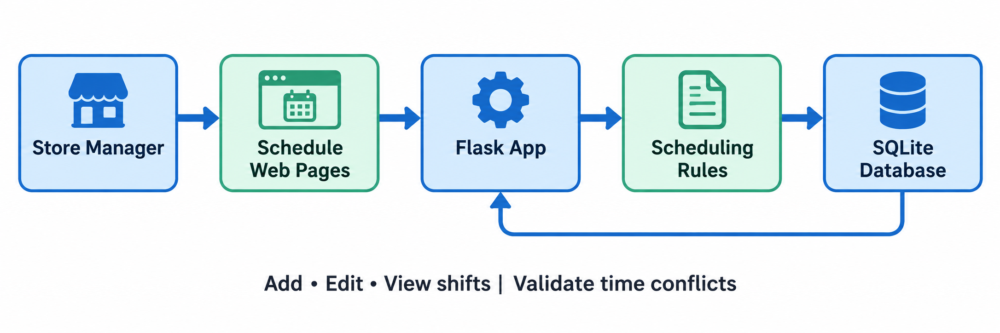
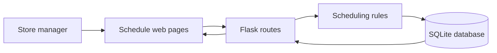
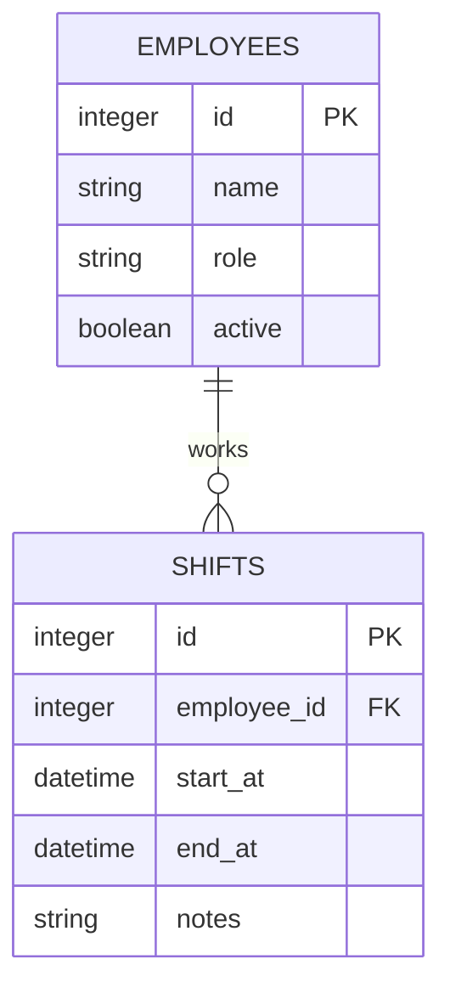

# Architecture Guide

This is the shared starting design. Keep the first version small; add
complexity only when a feature needs it.

## System flow

1. The manager opens the schedule page and enters a change.
2. A Flask route validates the request.
3. Scheduling rules check required fields, correct time ranges, and conflicts.
4. Valid data is stored in SQLite.
5. The schedule view reloads from SQLite, so everyone sees a consistent view.

## Components and responsibilities

| Component | Responsibility | Do not put here |
| --- | --- | --- |
| `templates/` and `static/` | Forms, weekly schedule, helpful error messages | SQL queries or conflict logic |
| Flask routes | Receive requests and return pages/JSON | Large blocks of business rules |
| Scheduling rules | Validate time ranges and overlapping employee shifts | HTML or direct browser logic |
| `db.py` | Database connection, schema, small query helpers | User-interface decisions |
| SQLite | Employees and shifts | Passwords or production secrets |

## Data model

### Rules for version 1

- A shift must have one active employee.
- `end_at` must be after `start_at`.
- One employee cannot have two shifts that overlap.
- Dates and times should use an ISO format internally, for example
  `2026-09-17T09:00`.

## Suggested team split

| Person | Initial responsibility | First deliverable |
| --- | --- | --- |
| 1 — Product/UI | Wireframe and build the schedule view | Weekly schedule page |
| 2 — Employee management | Employee add/edit/list routes | Employee CRUD |
| 3 — Shift management | Shift add/edit/delete routes and validation | Shift CRUD + time checks |
| 4 — Quality/integration | Tests, error states, README, merge support | Conflict tests and setup guide |

Everyone should review pull requests and help integrate changes. If the group
has different strengths, swap responsibilities—not the component boundaries.

## Simple API plan

Start with normal Flask pages. If the UI later needs dynamic updates, add these
small JSON endpoints:

| Method | Route | Purpose |
| --- | --- | --- |
| `GET` | `/api/employees` | List employees |
| `POST` | `/api/employees` | Add employee |
| `GET` | `/api/shifts?start=...&end=...` | List shifts in a date range |
| `POST` | `/api/shifts` | Create shift after validation |
| `PATCH` | `/api/shifts/<id>` | Modify a shift |
| `DELETE` | `/api/shifts/<id>` | Remove a shift |

## Definition of done for each feature

- It works from the manager’s point of view.
- Invalid inputs show an understandable message.
- The change has at least one test when practical.
- The README or this document is updated if behavior or setup changes.
